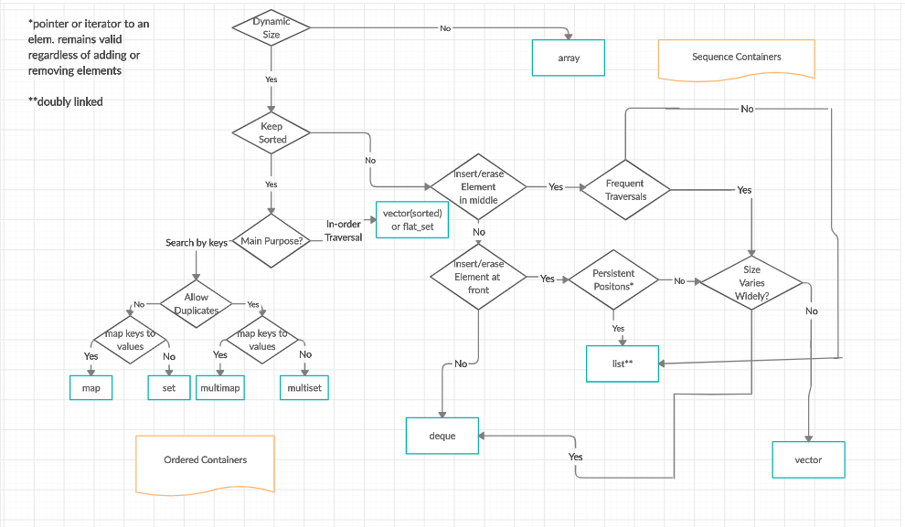

# cpp-algorithms
Collection of data structures and different algorithms implemented in C++

---
## Contents:

### **Algorithms:**

- Sorting
    - [Bubble Sort](src/algorithms/sorting/bubble_sort.cpp)
    - [Merge Sort](src/algorithms/sorting/merge_sort.cpp)
    - [Quick Sort](src/algorithms/sorting/quick_sort.cpp)
    - [Binary Insertion Sort](src/algorithms/sorting/binary_insertion.cpp)
    - [Heap Sort](src/algorithms/sorting/heap_sort.cpp)
- Searching
    - [Linear Search](src/algorithms/searching/linear_search.cpp)
    - [Binary Search](src/algorithms/searching/binary_search.cpp)
    - [Interpolation Search](src/algorithms/searching/interpolation_search.cpp)
- Other STL Algorithms
    - [Reverse](src/algorithms/other_stl/other_stl_algo.cpp)
    - [Max Element](src/algorithms/other_stl/other_stl_algo.cpp)
    - [Min Element](src/algorithms/other_stl/other_stl_algo.cpp)
    - [Accumulate](src/algorithms/other_stl/other_stl_algo.cpp)
    - [Count](src/algorithms/other_stl/other_stl_algo.cpp)
    - [Find](src/algorithms/other_stl/other_stl_algo.cpp)
    - [Lower/Upper Bound](src/algorithms/other_stl/other_stl_algo.cpp)
    - [More](https://www.geeksforgeeks.org/c-magicians-stl-algorithms/)

### **Data Structures:**
- Sequential Containers - Accesed in a sequential manner
    - [Vector]()
    - [List]()
    - [Deque]()
    - [Array]()
    - [Forward List*]()
- Container Adaptors - Different interfaces for sequential containers
    - [Queue]()
    - [Priority Queue]()
    - [Stack]()
- Associative Containers - Sorted Data - Search time: O(log n)
    - [Set]()
    - [Map]()
    - [Multiset]()
    - [Multimap]()
    - [Pair]()
- Unordered Associative Containers - Quickly search unsorted data
    - [Unordered Set*]()
    - [Unordered Map*]()
    - [Unordered Multiset*]()
    - [Unordered Multimap*]()

##### * Introduced in C++11

## Flowcharts of datastructures

#### Source: [GeeksForGeeks](https://www.geeksforgeeks.org/the-c-standard-template-library-stl/)